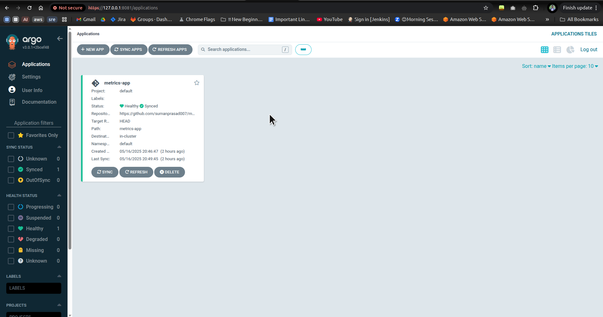
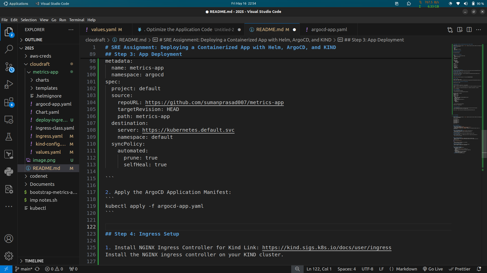
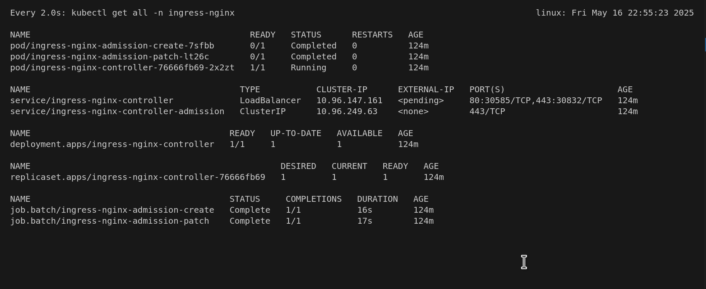
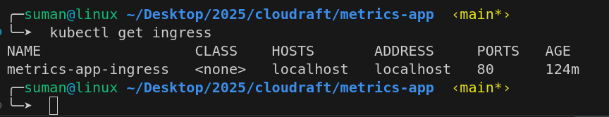
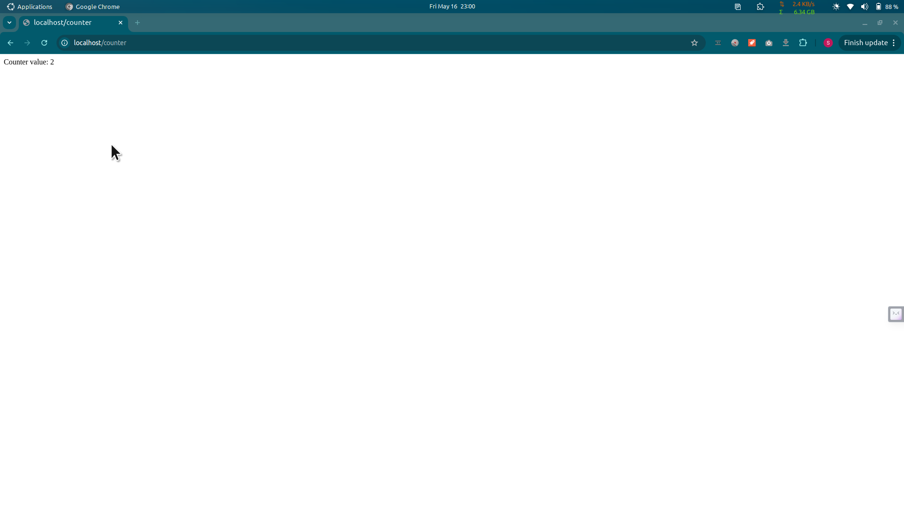
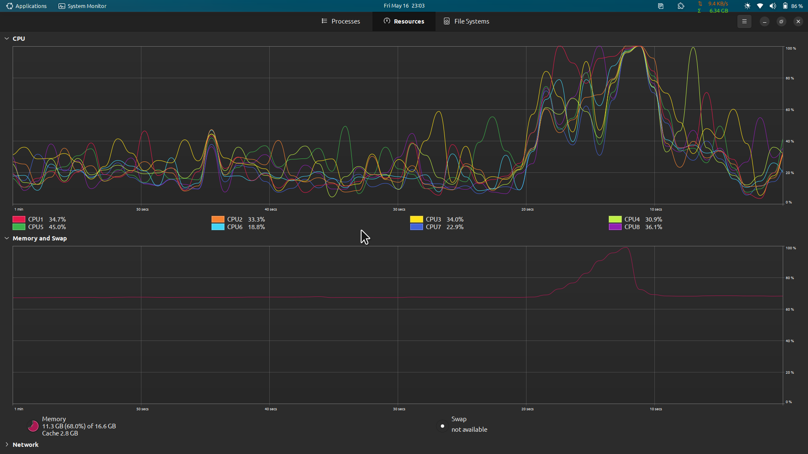

# SRE Assignment: Deploying a Containerized App with Helm, ArgoCD, and KIND

## Objective
Deploy a containerized app that exposes a `/counter` endpoint using Helm, ArgoCD, and KIND, and investigate any issues with the app behavior.

## Prerequisites
- Docker
- kubectl
- Helm
- KIND (Kubernetes IN Docker)
- kubectl CLI 

## Step 1: Helm Chart Creation

### Initialize Helm Chart
```
helm create metrics-app
```

### Edit Helm chart values.yaml
```
image:
  repository: ghcr.io/cloudraftio/metrics-app
  tag: "1.4"
  pullPolicy: IfNotPresent

service:
  type: ClusterIP
  port: 8080

env:
- name: PASSWORD
  valueFrom:
    secretKeyRef:
      name: app-secret
      key: PASSWORD

ingress:
  enabled: false  

autoscaling:
  enabled: false  

serviceAccount:
  create: true
  annotations: {}
  automount: true

```

## Step 2: Local KIND Cluster Setup
Install KIND, Follow the KIND installation guide: https://kind.sigs.k8s.io/docs/user/ingress#create-cluster

### Create a KIND Cluster
```
kind create cluster --name metrics-app --config kind-config.yaml 
```

### Install kubectl on system
Follow the link to install kubectl. Link: https://kubernetes.io/docs/tasks/tools/install-kubectl-linux/

validate using: 
``` 
kubectl version
```

### Securely Pass the Secret

```
kubectl create secret generic app-secret --from-literal=PASSWORD=MYPASSWORD
```

### Install ArgoCD
```
kubectl create namespace argocd
kubectl apply -n argocd -f https://raw.githubusercontent.com/argoproj/argo-cd/stable/manifests/install.yaml
```

### Validate the pods status and wait for running status:
```
kubectl get pods -n argocd
```

### Configure ArgoCD
```
kubectl port-forward svc/argocd-server -n argocd 8081:443

# Access the ArgoCD UI at https://localhost:8081 and log in with the default username admin. Get the password using:

kubectl -n argocd get secret argocd-initial-admin-secret -o jsonpath="{.data.password}" | base64 -d
```


## Step 3: App Deployment

Create an ArgoCD Application Manifest

1. Create a YAML file for the ArgoCD application manifest:

```
apiVersion: argoproj.io/v1alpha1
kind: Application
metadata:
  name: metrics-app
  namespace: argocd
spec:
  project: default
  source:
    repoURL: https://github.com/sumanprasad007/metrics-app
    targetRevision: HEAD
    path: metrics-app
  destination:
    server: https://kubernetes.default.svc
    namespace: default
  syncPolicy:
    automated:
      prune: true
      selfHeal: true

```

2. Apply the ArgoCD Application Manifest:
```
kubectl apply -f argocd-app.yaml
```



## Step 4: Ingress Setup

1. Install NGINX Ingress Controller for Kind Link: https://kind.sigs.k8s.io/docs/user/ingress
Install the NGINX ingress controller on your KIND cluster.

```
kubectl apply -f https://kind.sigs.k8s.io/examples/ingress/deploy-ingress-nginx.yaml
```
2. Validate the pods are up and running:



3. Create an Ingress Resource:

Create an ingress resource to expose the app externally.

```
apiVersion: networking.k8s.io/v1
kind: Ingress
metadata:
  name: metrics-app-ingress
spec:
  # ingressClassName: nginx
  rules:
  - host: localhost
    http:
      paths:
      - path: /counter
        pathType: Prefix
        backend:
          service:
            name: metrics-app
            port:
              number: 8080

```

4. Apply the Ingress Resource:
```
kubectl apply -f ingress.yaml
```

5. Validate the ingress resources:
```
kubectl get ingress
```


## Step 5: Document the Behavior

1. Access the Endpoint:

Use the following command to access the /counter endpoint multiple times and observe the behavior.
```
for i in $(seq 0 20); do time curl localhost:8080/counter; done
```

2. Access in browser:
```
http://localhost/counter
```



## **6. Root Cause Analysis**

**Identify and document the root cause if any issues are found.**

1. Expereinced System lag due to CPU and Memory throlling, 



**Could you suggest or implement a fix if appropriate?**

2. Optimize the Application Code

- Avoid Global Variables: Using global variables like counter can lead to race conditions in a multi-threaded environment. 
- Asynchronous Operations: Ensure that asynchronous operations, such as metrics.trigger_background_collection(), are truly non-blocking and do not introduce delays.

3. Use a Production WSGI Server

- Gunicorn or uWSGI: Flask's built-in server is not suitable for running load. For a production-ready WSGI server like Gunicorn or uWSGI to serve your application.

